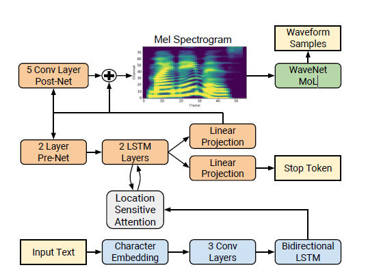
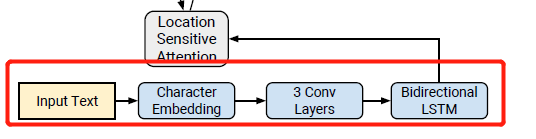
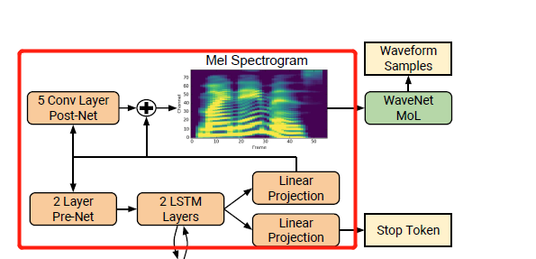
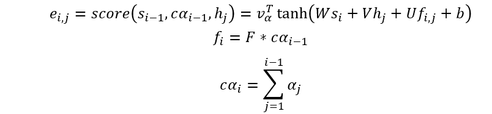

# Tactron2
## 论文框架

[原文:NATURAL TTS SYNTHESIS BY CONDITIONING WAVENET ON MEL SPECTROGRAM PREDICTIONS]
<https://arxiv.org/pdf/1712.05884v2.pdf>

***
### Encoder

文本输入后接Character Embedding网络（512维） 后跟三层卷积  每层卷积大小5×1（卷积个数512个，每个卷积核卷积5个字符）  每层卷积之间有batch normalization和RELU激活层，最后投入到双向LSTM(共512维，256/单向)
~~~
class Encoder(nn.Module):
    """Encoder module:
        - Three 1-d convolution banks
        - Bidirectional LSTM
    """
    def __init__(self, hparams):
        super(Encoder, self).__init__()

        convolutions = []
        for _ in range(hparams.encoder_n_convolutions):###hparams.encoder_n_convolutions=5
            conv_layer = nn.Sequential(
                ConvNorm(hparams.encoder_embedding_dim,##encoder_embediing_dim=512
                         hparams.encoder_embedding_dim,
                         kernel_size=hparams.encoder_kernel_size, stride=1,
                         padding=int((hparams.encoder_kernel_size - 1) / 2),
                         dilation=1, w_init_gain='relu'),
                nn.BatchNorm1d(hparams.encoder_embedding_dim))
            convolutions.append(conv_layer)
        self.convolutions = nn.ModuleList(convolutions)##

        self.lstm = nn.LSTM(hparams.encoder_embedding_dim,
                            int(hparams.encoder_embedding_dim / 2), 1,
                            batch_first=True, bidirectional=True)

    def forward(self, x, input_lengths):
        for conv in self.convolutions:
            x = F.dropout(F.relu(conv(x)), 0.5, self.training)

        x = x.transpose(1, 2)

        # pytorch tensor are not reversible, hence the conversion
        input_lengths = input_lengths.cpu().numpy()
        x = nn.utils.rnn.pack_padded_sequence(
            x, input_lengths, batch_first=True)

        self.lstm.flatten_parameters()
        outputs, _ = self.lstm(x)

        outputs, _ = nn.utils.rnn.pad_packed_sequence(
            outputs, batch_first=True)

        return outputs

~~~

***
### Decoder

每次一帧从encoded输入序列中预测一帧梅尔谱图。前一时刻的预测结果传递到pre-net中，pre-net包含两层全连层(内含256个ReLu隐单元)    pre-net作为信息瓶颈

Pre-net中的结果与上下文向量context-vector拼接递给两个包含1024个单元的单向LSTM，LSTM的输出结果与注意力context-vector通过线性变换预测梅尔频谱，最后预测的梅尔频谱经过五层卷积post-net预测残差，每一层由5×1的512个卷积核构成，除最后一层以外每一层都接一个tanh激活层

“stop token”:线性变换预测接sigmoid激活预测输出序列结束的可能性

~~~

    def forward(self, memory, decoder_inputs, memory_lengths):
        """ Decoder forward pass for training
        PARAMS
        ------
        memory: Encoder outputs
        decoder_inputs: Decoder inputs for teacher forcing. i.e. mel-specs
        memory_lengths: Encoder output lengths for attention masking.

        RETURNS
        -------
        mel_outputs: mel outputs from the decoder
        gate_outputs: gate outputs from the decoder
        alignments: sequence of attention weights from the decoder
        """

        decoder_input = self.get_go_frame(memory).unsqueeze(0)
        decoder_inputs = self.parse_decoder_inputs(decoder_inputs)
        decoder_inputs = torch.cat((decoder_input, decoder_inputs), dim=0)
        decoder_inputs = self.prenet(decoder_inputs)

        self.initialize_decoder_states(
            memory, mask=~get_mask_from_lengths(memory_lengths))

        mel_outputs, gate_outputs, alignments = [], [], []
        while len(mel_outputs) < decoder_inputs.size(0) - 1:
            decoder_input = decoder_inputs[len(mel_outputs)]
            mel_output, gate_output, attention_weights = self.decode(
                decoder_input)
            mel_outputs += [mel_output.squeeze(1)]
            gate_outputs += [gate_output.squeeze(1)]
            alignments += [attention_weights]

        mel_outputs, gate_outputs, alignments = self.parse_decoder_outputs(
            mel_outputs, gate_outputs, alignments)

        return mel_outputs, gate_outputs, alignments
~~~
## 位置敏感注意力机制

[原文:Attention-Based Models for Speech Recognition]
<https://proceedings.neurips.cc/paper/2015/file/1068c6e4c8051cfd4e9ea8072e3189e2-Paper.pdf>
* 实现时每一个时刻进行计算即一次计算一个词
~~~
  decoder_input = self.get_go_frame(memory).unsqueeze(0)
        decoder_inputs = self.parse_decoder_inputs(decoder_inputs)
        decoder_inputs = torch.cat((decoder_input, decoder_inputs), dim=0)
        decoder_inputs = self.prenet(decoder_inputs)

        self.initialize_decoder_states(
            memory, mask=~get_mask_from_lengths(memory_lengths))

        mel_outputs, gate_outputs, alignments = [], [], []
 ##     while len(mel_outputs) < decoder_inputs.size(0) - 1:
            decoder_input = decoder_inputs[len(mel_outputs)]
            mel_output, gate_output, attention_weights = self.decode(
                decoder_input)
            mel_outputs += [mel_output.squeeze(1)]
            gate_outputs += [gate_output.squeeze(1)]
            alignments += [attention_weights]

        mel_outputs, gate_outputs, alignments = self.parse_decoder_outputs(
            mel_outputs, gate_outputs, alignments)
~~~

