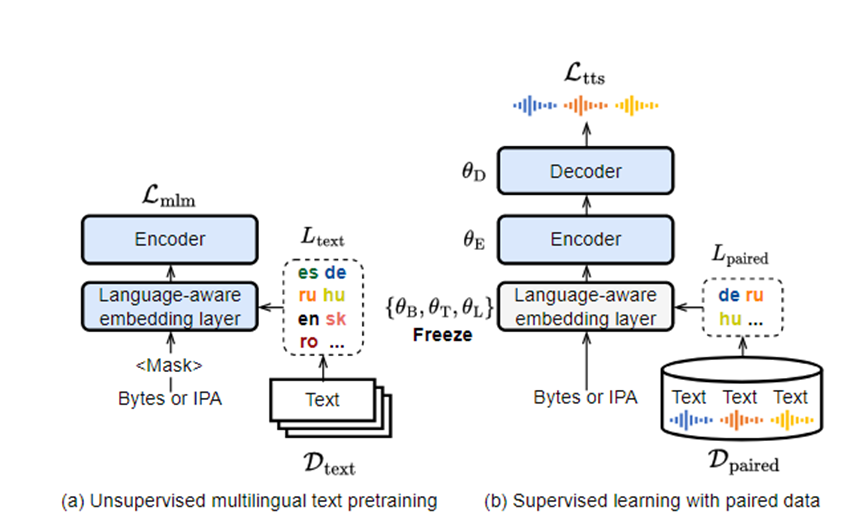

# Paper 
*Learning to Speak from Text: Zero-Shot Multilingual Text-to-Speech with Unsupervised Text Pretraining，IJCAI,2023*
## Motivation
传统的低资源语言TTS关注于speech data，忽略了文本的信息内容，本文的工作聚焦于挖掘文本信息来辅助TTS的训练
## Contribution
1. 提出了为unseen语言实现高度可理解的 TTS 的多语言 TTS 框架，字符错误率小于 12%。
2. 改进了seen语言的 TTS，从而产生了byte-based模型，没有字素到音素 (G2P) 模块，其性能优于基于音素的baseline
3. 消融研究提供了额外的见解，包括冻结的语言感知嵌入层的有效性。
## Method
Let $X=\left(x_n \in V \mid n=\right.$ $1, \cdots, N)$ denote the input text token sequence of length $N$ 

$Z^{\mathrm{m}}=\operatorname{Embed}\left(X^{\mathrm{m}} ; \theta_{\mathrm{T}}\right), \quad e_l=\operatorname{Embed}\left(l_{\text {text }} ; \theta_{\mathrm{L}}\right)$
$$
\begin{aligned}
\mathcal{L}_{\mathrm{mlm}} & =\frac{1}{K} \sum_{k=1}^K \log p\left(x_{\pi_k} \mid X^{\mathrm{m}}\right) \\
\left\{\hat{\theta}_{\mathrm{E}}, \hat{\theta}_{\mathrm{B}}, \hat{\theta}_{\mathrm{T}}, \hat{\theta}_{\mathrm{L}}\right\} & =\underset{\theta_{\mathrm{E}}, \theta_{\mathrm{B}}, \theta_{\mathrm{T}}, \theta_{\mathrm{L}}}{\arg \min _{\mathrm{m}}} \mathcal{L}_{\mathrm{mlm}} .
\end{aligned}
$$
